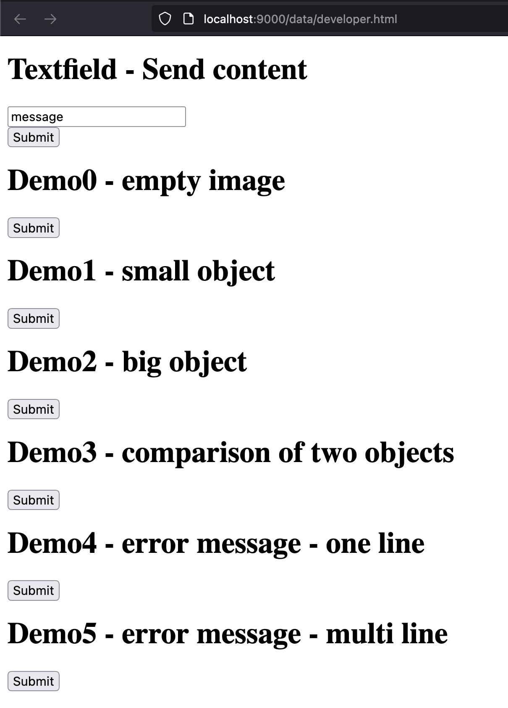

# Console for inspecting ARC tasks (Abstraction and Reasoning Corpus) 

Screenshots of what the console output looks like:


# Step 1 - Start the server

```
PROMPT> cargo run
   Compiling arc_console v0.1.0 (/Users/neoneye/git/arc-console)
    Finished dev [unoptimized + debuginfo] target(s) in 1.79s
     Running `target/debug/arc_console`
Webserver - Listening on: 'localhost:9000' - Open this in the browser to see the console.
CTRL-C to stop the server.
```

# Step 2 - Open the `localhost:9000` in the browser


# Step 3 - Open the `viewer` page in one tab


# Step 4 - Open the `developer` page in another tab



Click on some of the buttons, and see the console being updated.

# Step 5 - Send data to the server

```
PROMPT> curl -d '{"message":"hello"}' -H "Content-Type: application/json" -X POST http://localhost:9000/event
```

It should now append the message `hello` at the bottom.


